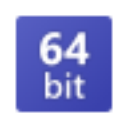

# Base64 Helper - Brave/Chrome Extension



A sleek, modern, and efficient browser extension for developers to quickly encode and decode Base64 text right within Brave or any Chromium-based browser.

---

## 🌟 Features

Base64 Helper is designed to be minimal yet powerful, integrating seamlessly into your workflow.

- **Elegant Dark UI**: A beautiful, symmetrical, and modern dark theme that's easy on the eyes.
- **Popup Interface**: Open the extension to quickly paste and convert text.
  - Encode plain text to Base64.
  - Decode Base64 to plain text.
- **On-the-Fly Decoding**: Simply select any text on a webpage to bring up a quick decoder.
  - **Selection Popup**: A small, unobtrusive popup appears over selected text.
  - **Decoder Modal**: Click the popup to view the decoded content in a clean, centered modal.
- **Clickable URL Detection**: If the decoded text is a valid URL, it automatically becomes a clickable link that opens in a new tab.
- **Right-Click Context Menu**: A classic right-click menu option to decode any selected text.
- **Copy to Clipboard**: Easily copy the result with a single click.

---

## 🚀 Installation

You can install this extension in Brave, Google Chrome, or any other Chromium-based browser.

### Manual Installation (Load Unpacked)

1. **Download the Repository**: Download this project from GitHub, preferably by cloning the repository or downloading the ZIP file.

   ```bash
   git clone https://github.com/ismailmajeeb/Base64-Helper.git
   ```

2. **Navigate to Extensions**: Open your browser and go to the extensions page.
   - **Brave**: `brave://extensions`
   - **Chrome**: `chrome://extensions`
3. **Enable Developer Mode**: In the top-right corner of the extensions page, toggle on "Developer mode".
4. **Load the Extension**: Click the "Load unpacked" button that appears on the top-left.
5. **Select the Folder**: In the file selection window, navigate to and select the folder containing this project's code (the one with `manifest.json`).

The extension is now installed and ready to use!

---

## 🔧 How to Use

### Using the Popup

1. Click the **Base64 Helper** icon in your browser's toolbar.
2. Enter text or a Base64 string into the "Input" field.
3. Click **Encode** or **Decode**.
4. The result will appear in the "Output" field. If the result is a URL, you can click it directly.

### Using the On-Page Decoder

1. On any webpage, select a piece of Base64-encoded text with your mouse.
2. A small **"B64"** button will appear near your selected text.
3. Click the button to open a modal displaying the decoded text.

---

## ❤️ Contributing

Contributions are welcome! If you have ideas for new features, improvements, or bug fixes, please follow these steps:

1. **Fork the repository**.
2. Create a new branch for your feature (`git checkout -b feature/AmazingFeature`).
3. Commit your changes (`git commit -m 'Add some AmazingFeature'`).
4. Push to the branch (`git push origin feature/AmazingFeature`).
5. Open a **Pull Request**.

---

## 📄 License

This project is open source and available under the [MIT License](LICENSE).
